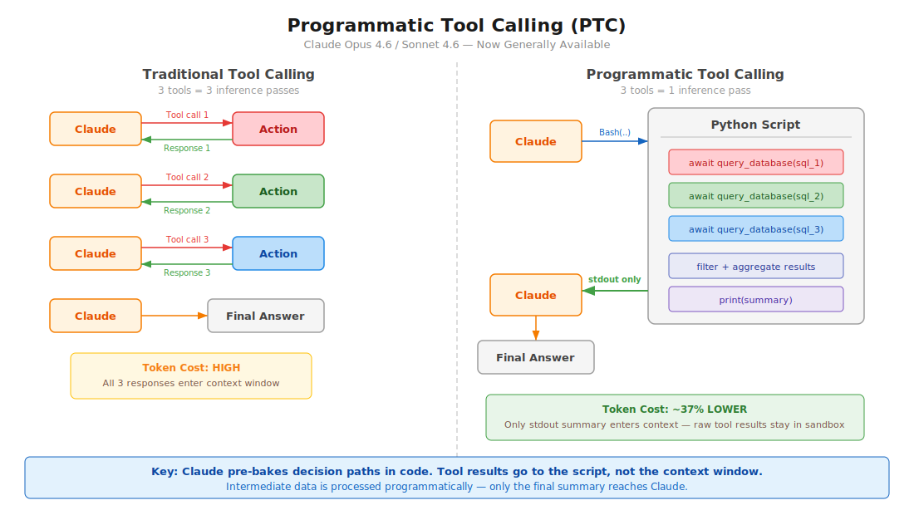

# Claude Advanced Tool Use Patterns

API-level features (now GA) that reduce token consumption, latency, and improve tool accuracy. Released with Opus/Sonnet 4.6.

<table width="100%">
<tr>
<td><a href="../">← Back to Claude Code Best Practice</a></td>
<td align="right"></td>
</tr>
</table>

## Table of Contents

1. [Overview](#overview)
2. [Programmatic Tool Calling (PTC)](#programmatic-tool-calling-ptc)
3. [Dynamic Filtering for Web Search/Fetch](#dynamic-filtering-for-web-searchfetch)
4. [Tool Search Tool](#tool-search-tool)
5. [Tool Use Examples](#tool-use-examples)
6. [Claude Code Relevance](#claude-code-relevance)

---

## Overview

| Feature | Problem Solved | Token Savings | Availability |
|---------|---------------|---------------|--------------|
| Programmatic Tool Calling | Multi-step agent loops burn tokens on round trips | ~37% reduction | API, Foundry (GA) |
| Dynamic Filtering | Web search/fetch results bloat context with irrelevant content | ~24% fewer input tokens | API, Foundry (GA) |
| Tool Search Tool | Too many tool definitions bloat context | ~85% reduction | API, Foundry (GA) |
| Tool Use Examples | Schema alone can't express usage patterns | 72% → 90% accuracy | API, Foundry (GA) |

All features are **generally available** as of February 18, 2026.

**Strategic layering** — start with your biggest bottleneck:
- Context bloat from tool definitions → Tool Search Tool
- Large intermediate results → Programmatic Tool Calling
- Web search noise → Dynamic Filtering
- Parameter errors → Tool Use Examples

---

## Programmatic Tool Calling (PTC)



### The Paradigm Shift

**Before (Traditional Tool Calling):**
```
User prompt → Claude → Tool call 1 → Response 1 → Claude → Tool call 2 → Response 2 → Claude → Tool call 3 → Response 3 → Claude → Final answer
```
Each tool call requires a full model round trip. 3 tools = 3 inference passes.

**After (Programmatic Tool Calling):**
```
User prompt → Claude → writes Python script → Script calls Tool 1, Tool 2, Tool 3 internally → stdout → Claude → Final answer
```
Claude writes code that orchestrates all tools. Only the final `stdout` enters the context window. 3 tools = 1 inference pass.

### How It Works

1. You define tools with `allowed_callers: ["code_execution_20250825"]`
2. Claude writes Python that calls those tools as async functions inside a sandbox
3. When a tool function is called, the sandbox pauses and the API returns a `tool_use` block
4. You provide the tool result — it goes to the **running code**, not Claude's context
5. Code resumes, processes results, calls more tools if needed
6. Only `stdout` from the final execution reaches Claude

### Key Configuration

```json
{
  "tools": [
    {
      "type": "code_execution_20250825",
      "name": "code_execution"
    },
    {
      "name": "query_database",
      "description": "Execute a SQL query. Returns rows as JSON objects with fields: id (str), name (str), revenue (float).",
      "input_schema": {
        "type": "object",
        "properties": {
          "sql": { "type": "string", "description": "SQL query to execute" }
        },
        "required": ["sql"]
      },
      "allowed_callers": ["code_execution_20250825"]
    }
  ]
}
```

### The `allowed_callers` Field

| Value | Behavior |
|-------|----------|
| `["direct"]` | Traditional tool calling only (default if omitted) |
| `["code_execution_20250825"]` | Only callable from Python sandbox |
| `["direct", "code_execution_20250825"]` | Both modes available |

**Recommendation:** Choose one mode per tool, not both. This gives Claude clearer guidance.

### The `caller` Field in Responses

Every tool use block includes a `caller` field so you know how it was invoked:

```json
// Direct (traditional)
{ "caller": { "type": "direct" } }

// Programmatic (from code execution)
{ "caller": { "type": "code_execution_20250825", "tool_id": "srvtoolu_abc123" } }
```

### Advanced Patterns

**Batch processing** — process N items in 1 inference pass:
```python
regions = ["West", "East", "Central", "North", "South"]
results = {}
for region in regions:
    data = await query_database(f"SELECT SUM(revenue) FROM sales WHERE region='{region}'")
    results[region] = data[0]["revenue"]

top = max(results.items(), key=lambda x: x[1])
print(f"Top region: {top[0]} with ${top[1]:,}")
```

**Early termination** — stop as soon as success criteria are met:
```python
endpoints = ["us-east", "eu-west", "apac"]
for endpoint in endpoints:
    status = await check_health(endpoint)
    if status == "healthy":
        print(f"Found healthy endpoint: {endpoint}")
        break
```

**Conditional tool selection:**
```python
file_info = await get_file_info(path)
if file_info["size"] < 10000:
    content = await read_full_file(path)
else:
    content = await read_file_summary(path)
print(content)
```

**Data filtering** — reduce what Claude sees:
```python
logs = await fetch_logs(server_id)
errors = [log for log in logs if "ERROR" in log]
print(f"Found {len(errors)} errors")
for error in errors[-10:]:
    print(error)
```

### Model Compatibility

| Model | Supported |
|-------|-----------|
| Claude Opus 4.6 | Yes |
| Claude Sonnet 4.6 | Yes |
| Claude Sonnet 4.5 | Yes |
| Claude Opus 4.5 | Yes |

### Constraints

| Constraint | Detail |
|-----------|--------|
| **Not on Bedrock/Vertex** | API and Foundry only |
| **No MCP tools** | MCP connector tools cannot be called programmatically |
| **No web search/fetch** | Web tools not supported in PTC |
| **No structured outputs** | `strict: true` tools incompatible |
| **No forced tool choice** | `tool_choice` cannot force PTC |
| **Container lifetime** | ~4.5 minutes before expiry |
| **ZDR** | Not covered by Zero Data Retention |
| **Tool results as strings** | Validate external results for code injection risks |

### When to Use PTC

| Good Use Cases | Less Ideal |
|----------------|------------|
| Processing large datasets needing aggregates | Single tool calls with simple responses |
| 3+ dependent tool calls in sequence | Tools needing immediate user feedback |
| Filtering/transforming results before Claude sees them | Very fast operations (overhead > benefit) |
| Parallel operations across many items | |
| Conditional logic based on intermediate results | |

### Token Efficiency

- Tool results from programmatic calls are **not added to Claude's context** — only final `stdout`
- Intermediate processing happens in code, not model tokens
- 10 tools programmatically ≈ 1/10th the tokens of 10 direct calls

---

## Dynamic Filtering for Web Search/Fetch

### The Problem

Web search and fetch tools dump full HTML pages into Claude's context window. Most of that content is irrelevant — navigation, ads, boilerplate. Claude then reasons over all of it, wasting tokens and reducing accuracy.

### The Solution

Claude now **writes and executes Python code to filter web results** before they enter the context window. Instead of reasoning over raw HTML, Claude filters, parses, and extracts only relevant content in a sandbox.

### How It Works

**Before:**
```
Query → Search results → Fetch full HTML × N pages → All content enters context → Claude reasons over everything
```

**After:**
```
Query → Search results → Claude writes filtering code → Code extracts relevant content only → Filtered results enter context
```

### API Configuration

Uses updated tool type versions with a beta header:

```json
{
  "model": "claude-opus-4-6",
  "max_tokens": 4096,
  "tools": [
    {
      "type": "web_search_20260209",
      "name": "web_search"
    },
    {
      "type": "web_fetch_20260209",
      "name": "web_fetch"
    }
  ]
}
```

**Header required:** `anthropic-beta: code-execution-web-tools-2026-02-09`

**Enabled by default** when using the new tool type versions with Sonnet 4.6 and Opus 4.6.

### Benchmark Results

**BrowseComp** (finding specific information on websites):

| Model | Without Filtering | With Filtering | Improvement |
|-------|-------------------|----------------|-------------|
| Sonnet 4.6 | 33.3% | **46.6%** | +13.3 pp |
| Opus 4.6 | 45.3% | **61.6%** | +16.3 pp |

**DeepsearchQA** (multi-step research, F1 score):

| Model | Without Filtering | With Filtering | Improvement |
|-------|-------------------|----------------|-------------|
| Sonnet 4.6 | 52.6% | **59.4%** | +6.8 pp |
| Opus 4.6 | 69.8% | **77.3%** | +7.5 pp |

**Token efficiency:** Average 24% fewer input tokens. Sonnet 4.6 sees cost reduction; Opus 4.6 may increase slightly due to more complex filtering code.

### Use Cases

- Sifting through technical documentation
- Verifying citations across multiple sources
- Cross-referencing search results
- Multi-step research queries
- Finding specific data points buried in large pages

---

## Tool Search Tool

### The Problem

Loading all tool definitions upfront wastes context. If you have 50 MCP tools at ~1.5K tokens each, that's 75K tokens before the user even asks a question.

### The Solution

Mark infrequently-used tools with `defer_loading: true`. They're excluded from the initial context. Claude discovers them on-demand via a Tool Search Tool.

### Configuration

```json
{
  "tools": [
    {
      "type": "mcp_toolset",
      "mcp_server_name": "google-drive",
      "default_config": { "defer_loading": true },
      "configs": {
        "search_files": { "defer_loading": false }
      }
    }
  ]
}
```

### Best Practices

- Keep 3-5 most-used tools always loaded, defer the rest
- Write clear, descriptive tool names and descriptions (search relies on them)
- Document available capabilities in the system prompt

### When to Use

- Tool definitions consuming > 10K tokens
- 10+ tools available
- Multiple MCP servers
- Tool selection accuracy issues from too many options

### Token Savings

~85% reduction in tool definition tokens (77K → 8.7K in Anthropic's benchmarks).

### Claude Code Equivalent

Claude Code has **MCP tool search auto mode** (enabled by default since v2.1.7). When MCP tool descriptions exceed 10% of context, they're deferred and discovered via `MCPSearch`. Configure the threshold with `ENABLE_TOOL_SEARCH=auto:N` where N is the context percentage (0-100).

---

## Tool Use Examples

### The Problem

JSON schemas define structure but can't express:
- When to include optional parameters
- Which parameter combinations make sense
- Format conventions (date formats, ID patterns)
- Nested structure usage

### The Solution

Add `input_examples` to tool definitions — concrete usage patterns beyond the schema.

### Configuration

```json
{
  "name": "create_ticket",
  "description": "Create a support ticket",
  "input_schema": {
    "type": "object",
    "properties": {
      "title": { "type": "string" },
      "priority": { "type": "string", "enum": ["low", "medium", "high", "critical"] },
      "assignee": { "type": "string" },
      "labels": { "type": "array", "items": { "type": "string" } }
    },
    "required": ["title"]
  },
  "input_examples": [
    {
      "title": "Login page returns 500 error",
      "priority": "critical",
      "assignee": "oncall-team",
      "labels": ["bug", "auth", "production"]
    },
    {
      "title": "Add dark mode support",
      "priority": "low",
      "labels": ["feature-request", "ui"]
    },
    {
      "title": "Update API docs for v2 endpoints"
    }
  ]
}
```

### Best Practices

- Use **realistic data**, not placeholder strings like "example_value"
- Show **variety**: minimal, partial, and full specifications
- Keep concise: **1-5 examples per tool**
- Focus on resolving ambiguity — target behavioral clarity over schema completeness
- Show parameter correlations (e.g., `priority: "critical"` tends to have `assignee`)

### Results

72% → 90% accuracy on complex parameter handling in Anthropic's benchmarks.

---

## Claude Code Relevance

### What applies directly to Claude Code users

| Feature | Claude Code Status | Action |
|---------|-------------------|--------|
| Tool Search | Built-in since v2.1.7 as MCPSearch auto mode | Tune `ENABLE_TOOL_SEARCH=auto:N` if you have many MCP tools |
| Dynamic Filtering | Not available in CLI (API-level web tools) | Relevant for Agent SDK users doing web research |
| PTC | Not available in CLI | Relevant for Agent SDK users building custom agents |
| Tool Use Examples | Not configurable in CLI | Relevant for custom MCP server authors |

### For Agent SDK developers

If you're building agents with `@anthropic-ai/claude-agent-sdk`, PTC is immediately actionable:

1. Add `code_execution_20250825` to your tools array
2. Set `allowed_callers` on tools that benefit from batching/filtering
3. Implement the tool result loop (pause → provide result → resume)
4. Return structured data (JSON) from tools for easier programmatic parsing

### For MCP server authors

If you're building custom MCP servers, Tool Use Examples can improve how Claude uses your tools:
- Add `input_examples` to tool schemas
- Document return formats clearly in descriptions (PTC needs to parse them)

---

## Sources

- [Anthropic Engineering: Advanced Tool Use](https://www.anthropic.com/engineering/advanced-tool-use)
- [Programmatic Tool Calling Documentation](https://platform.claude.com/docs/en/agents-and-tools/tool-use/programmatic-tool-calling)
- [Code Execution Tool Documentation](https://platform.claude.com/docs/en/agents-and-tools/tool-use/code-execution-tool)
- [Improved Web Search with Dynamic Filtering](https://claude.com/blog/improved-web-search-with-dynamic-filtering)
