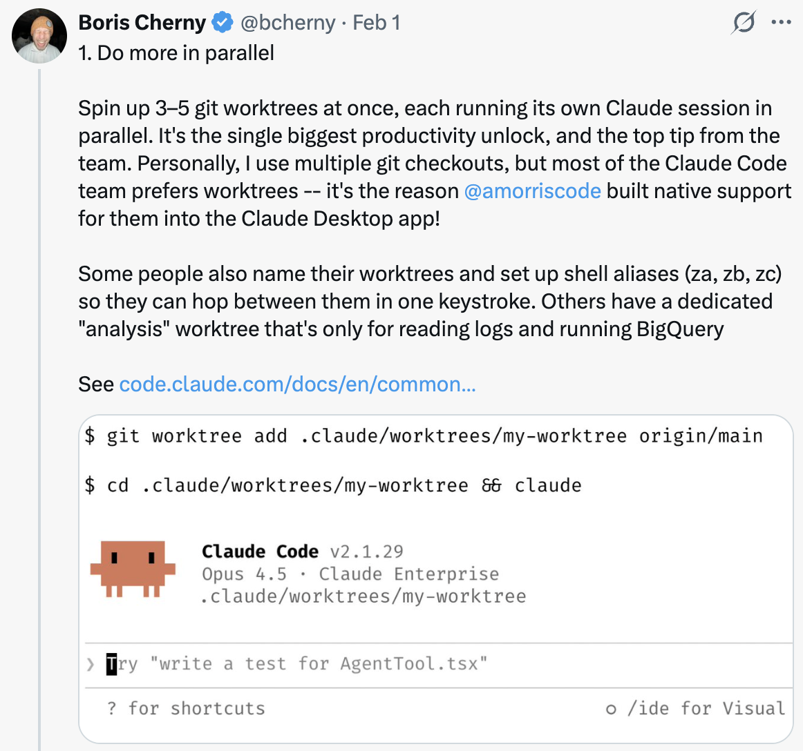
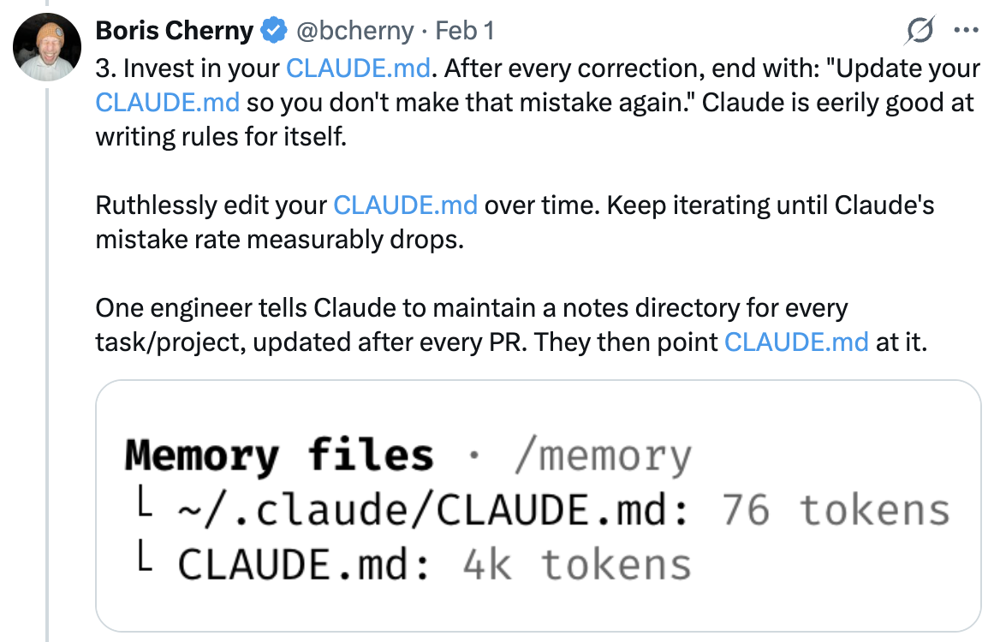
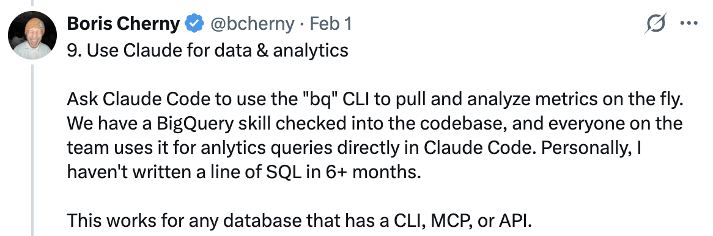

# 10 Tips for Using Claude Code — From the Claude Code Team

A summary of team tips shared by Boris Cherny ([@bcherny](https://x.com/bcherny)), creator of Claude Code, on February 1, 2026.

<table width="100%">
<tr>
<td><a href="../">← Back to Claude Code Best Practice</a></td>
<td align="right"></td>
</tr>
</table>

---

## Context

Boris shared tips for using Claude Code sourced directly from the Claude Code team. The way the team uses Claude is different than how Boris uses it personally. Remember: there is no one right way to use Claude Code — everyone's setup is different. You should experiment to see what works for you!

---

## 1/ Do More in Parallel

Spin up 3–5 git worktrees at once, each running its own Claude session in parallel. It's the single biggest productivity unlock, and the top tip from the team. Personally, Boris uses multiple git checkouts, but most of the Claude Code team prefers worktrees — it's the reason `@amorisscode` built native support for them into the Claude Desktop app!

Some people also name their worktrees and set up shell aliases (`2a`, `2b`, `2c`) so they can hop between them in one keystroke. Others have a dedicated "analysis" worktree that's only for reading logs and running BigQuery.

See: [Worktrees Docs](https://code.claude.com/docs/en/common...)

---

## 2/ Start Every Complex Task in Plan Mode

Pour your energy into the plan so Claude can 1-shot the implementation.

One person has one Claude write the plan, then they spin up a second Claude to review it as a staff engineer.

Another says the moment something goes sideways, they switch back to plan mode and re-plan. Don't keep pushing. They also explicitly tell Claude to enter plan mode for verification steps, not just for the build.

---

## 3/ Invest in Your CLAUDE.md

After every correction, end with: "Update your CLAUDE.md so you don't make that mistake again." Claude is eerily good at writing rules for itself.

Ruthlessly edit your `CLAUDE.md` over time. Keep iterating until Claude's mistake rate measurably drops.

One engineer tells Claude to maintain a notes directory for every task/project, updated after every PR. They then point `CLAUDE.md` at it.

---

## 4/ Create Your Own Skills and Commit Them to Git

Reuse across every project. Tips from the team:

- If you do something more than once a day, turn it into a skill or command
- Build a `/techdebt` slash command and run it at the end of every session to find and kill duplicated code
- Set up a slash command that syncs 7 days of Slack, GDrive, Asana, and GitHub into one context dump
- Build analytics-engineer-style agents that write dbt models, review code, and test changes in dev

See: [Extend Claude with Skills — Claude Code Docs](https://code.claude.com/docs/en/skills)

---

## 5/ Claude Fixes Most Bugs by Itself

Here's how the team does it:

Enable the Slack MCP, then paste a Slack bug thread into Claude and just say "fix." Zero context switching required.

Or, just say "Go fix the failing CI tests." Don't micromanage how.

Point Claude at docker logs to troubleshoot distributed systems — it's surprisingly capable at this.

---

## 6/ Level Up Your Prompting

a. **Challenge Claude.** Say "Grill me on these changes and don't make a PR until I pass your test." Make Claude be your reviewer. Or, say "Prove to me this works" and have Claude diff behavior between main and your feature branch.

b. **After a mediocre fix,** say: "Knowing everything you know now, scrap this and implement the elegant solution."

c. **Write detailed specs** and reduce ambiguity before handing work off. The more specific you are, the better the output.

---

## 7/ Terminal & Environment Setup

The team loves Ghostty! Multiple people like its synchronized rendering, 24-bit color, and proper unicode support.

For easier Claude-juggling, use `/statusline` to customize your status bar to always show context usage and current git branch. Many also color-code and name their terminal tabs, sometimes using tmux — one tab per task/worktree.

Use voice dictation. You speak 3x faster than you type, and your prompts get way more detailed as a result. (hit fn x2 on macOS)

See: [Terminal Setup Docs](https://code.claude.com/docs/en/termin...)

---

## 8/ Use Subagents

a. Append "use subagents" to any request where you want Claude to throw more compute at the problem.

b. Offload individual tasks to subagents to keep your main agent's context window clean and focused.

c. Route permission requests to Opus 4.5 via a hook — let it scan for attacks and auto-approve the safe ones. See: [Hooks Docs](https://code.claude.com/docs/en/hooks#...)

---

## 9/ Use Claude for Data & Analytics

Ask Claude Code to use the "bq" CLI to pull and analyze metrics on the fly. The team has a BigQuery skill checked into the codebase, and everyone uses it for analytics queries directly in Claude Code. Personally, Boris hasn't written a line of SQL in 6+ months.

This works for any database that has a CLI, MCP, or API.

---

## 10/ Learning with Claude

A few tips from the team to use Claude Code for learning:

a. Enable the "Explanatory" or "Learning" output style in `/config` to have Claude explain the "why" behind its changes.

b. Have Claude generate a visual HTML presentation explaining unfamiliar code. It makes surprisingly good slides!

c. Ask Claude to draw ASCII diagrams of new protocols and codebases to help you understand them.

d. Build a spaced-repetition learning skill: you explain your understanding, Claude asks follow-ups to fill gaps, stores the result.

---

## Sources

- [Boris Cherny (@bcherny) on X — February 1, 2026](https://x.com/bcherny/status/2017742741636321619)
