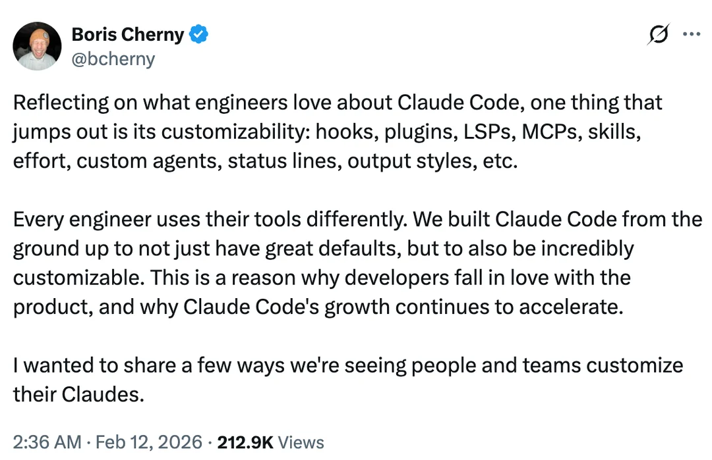
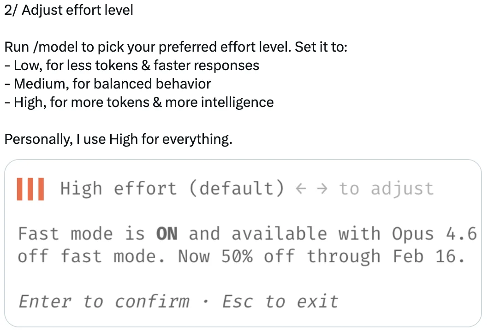
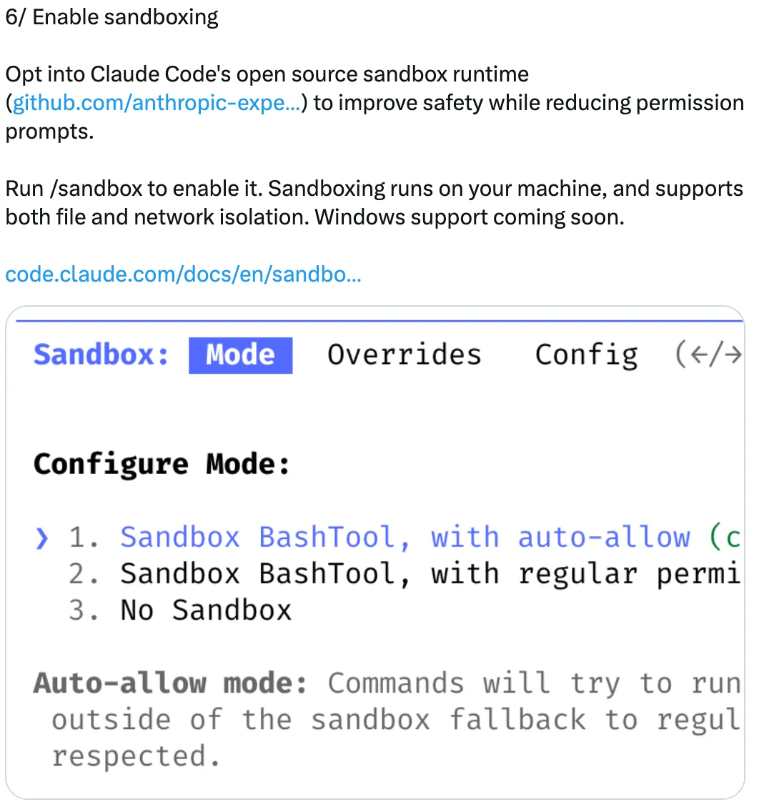
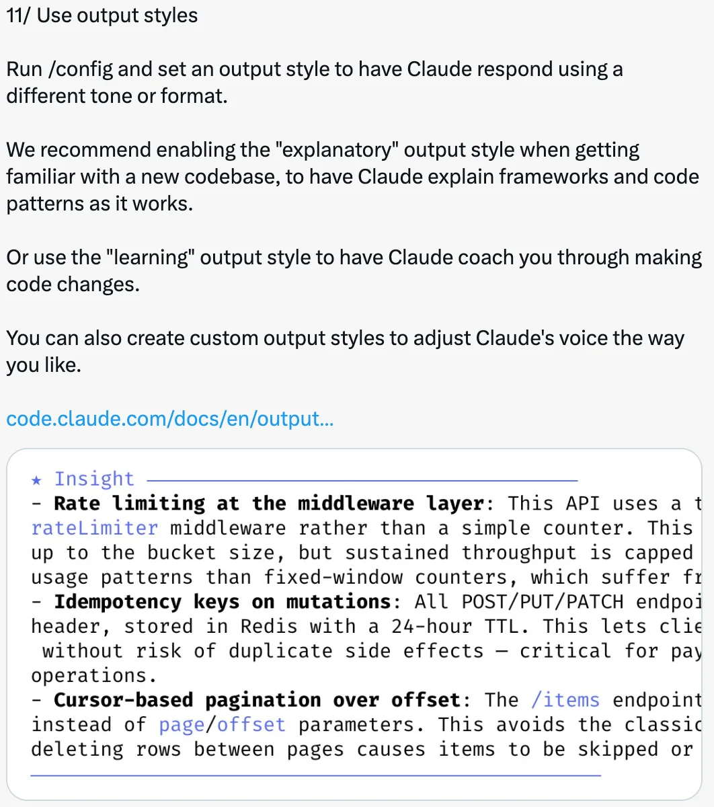

# 12 Ways to Customize Claude Code — Tips from Boris Cherny

A summary of customization tips shared by Boris Cherny ([@bcherny](https://x.com/bcherny)), creator of Claude Code, on February 12, 2026.

<table width="100%">
<tr>
<td><a href="../">← Back to Claude Code Best Practice</a></td>
<td align="right"></td>
</tr>
</table>

---

## Context

Boris Cherny highlighted that customizability is one of the things engineers love most about Claude Code — hooks, plugins, LSPs, MCPs, skills, effort, custom agents, status lines, output styles, and more. He shared 12 practical ways developers and teams are customizing their setups.

---

## 1/ Configure Your Terminal

Set up your terminal for the best Claude Code experience:

- **Theme**: Run `/config` to set light/dark mode
- **Notifications**: Enable notifications for iTerm2, or use a custom notification hook
- **Newlines**: If using Claude Code in an IDE terminal, Apple Terminal, Warp, or Alacritty, run `/terminal-setup` to enable shift+enter for newlines (so you don't need to type `\`)
- **Vim mode**: Run `/vim`

---

## 2/ Adjust Effort Level

Run `/model` to pick your preferred effort level:

- **Low** — fewer tokens, faster responses
- **Medium** — balanced behavior
- **High** — more tokens, more intelligence

Boris's preference: High for everything.

---

## 3/ Install Plugins, MCPs, and Skills

Plugins let you install LSPs (available for every major language), MCPs, skills, agents, and custom hooks.

Install from the official Anthropic plugin marketplace, or create your own marketplace for your company. Check the `settings.json` into your codebase to auto-add the marketplaces for your team.

Run `/plugin` to get started.

---

## 4/ Create Custom Agents

Drop `.md` files in `.claude/agents` to create custom agents. Each agent can have a custom name, color, tool set, pre-allowed and pre-disallowed tools, permission mode, and model.

You can also set the default agent for the main conversation using the `"agent"` field in `settings.json` or the `--agent` flag.

Run `/agents` to get started.

---

## 5/ Pre-approve Common Permissions

Claude Code uses a permission system combining prompt injection detection, static analysis, sandboxing, and human oversight.

Out of the box, a small set of safe commands are pre-approved. To pre-approve more, run `/permissions` and add to the allow and block lists. Check these into your team's `settings.json`.

Full wildcard syntax is supported — e.g., `Bash(bun run *)` or `Edit(/docs/**)`.

---

## 6/ Enable Sandboxing

Opt into Claude Code's open source sandbox runtime to improve safety while reducing permission prompts.

Run `/sandbox` to enable it. Sandboxing runs on your machine and supports both file and network isolation.

---

## 7/ Add a Status Line

Custom status lines show up right below the composer, displaying model, directory, remaining context, cost, and anything else you want to see while you work.

Every team member can have a different statusline. Use `/statusline` to have Claude generate one based on your `.bashrc`/`.zshrc`.

---

## 8/ Customize Your Keybindings

Every key binding in Claude Code is customizable. Run `/keybindings` to re-map any key. Settings live reload so you can see how it feels immediately.

---

## 9/ Set Up Hooks

Hooks let you deterministically hook into Claude's lifecycle:

- Automatically route permission requests to Slack or Opus
- Nudge Claude to keep going when it reaches the end of a turn (you can even kick off an agent or use a prompt to decide whether Claude should keep going)
- Pre-process or post-process tool calls, e.g., to add your own logging

Ask Claude to add a hook to get started.

---

## 10/ Customize Your Spinner Verbs

Customize your spinner verbs to add or replace the default list with your own verbs. Check the `settings.json` into source control to share verbs with your team.

---

## 11/ Use Output Styles

Run `/config` and set an output style to have Claude respond using a different tone or format.

- **Explanatory** — recommended when getting familiar with a new codebase, to have Claude explain frameworks and code patterns as it works
- **Learning** — to have Claude coach you through making code changes
- **Custom** — create custom output styles to adjust Claude's voice

---

## 12/ Customize All the Things!

Claude Code works great out of the box, but when you do customize, check your `settings.json` into git so your team can benefit too. Configuration is supported at multiple levels:

- For your codebase
- For a sub-folder
- For just yourself
- Via enterprise-wide policies

With 37 settings and 84 environment variables (use the `"env"` field in your `settings.json` to avoid wrapper scripts), there's a good chance any behavior you want is configurable.

---

## Sources

- [Boris Cherny (@bcherny) on X — February 12, 2026](https://x.com/bcherny)
- [Claude Code Terminal Setup Docs](https://code.claude.com/docs/en/terminal)
- [Claude Code Plugins & Discovery Docs](https://code.claude.com/docs/en/discover-plugins)
- [Claude Code Sub-agents Docs](https://code.claude.com/docs/en/sub-agents)
- [Claude Code Permissions Docs](https://code.claude.com/docs/en/permissions)
- [Claude Code Sandbox Docs](https://code.claude.com/docs/en/sandbox)
- [Claude Code Status Line Docs](https://code.claude.com/docs/en/statusline)
- [Claude Code Keyboard Shortcuts Docs](https://code.claude.com/docs/en/keybindings)
- [Claude Code Hooks Reference](https://code.claude.com/docs/en/hooks)
- [Claude Code Output Styles Docs](https://code.claude.com/docs/en/output-styles)
- [Claude Code Settings Docs](https://code.claude.com/docs/en/settings)
