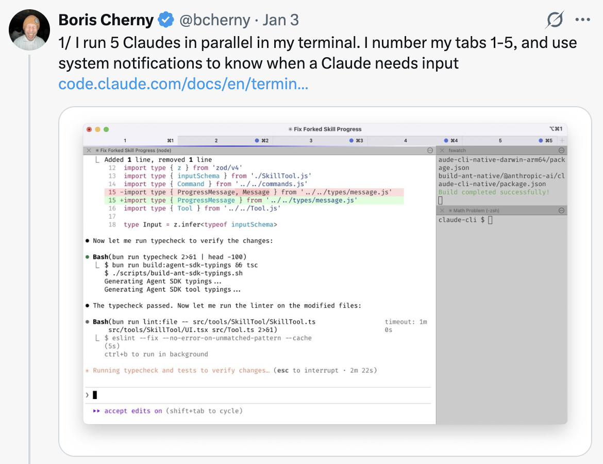
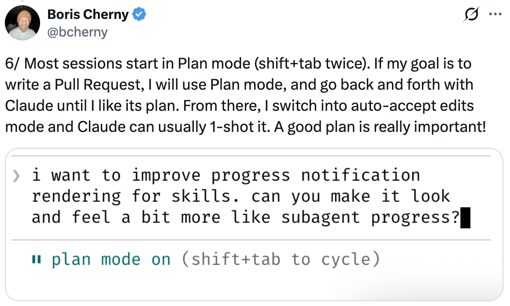
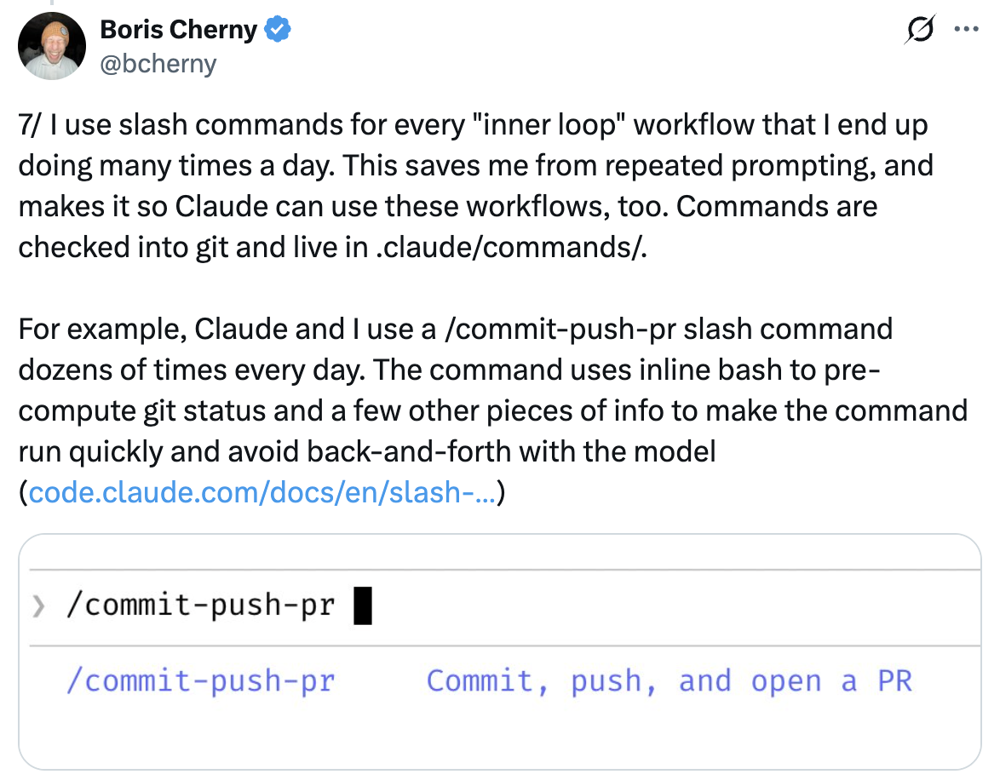
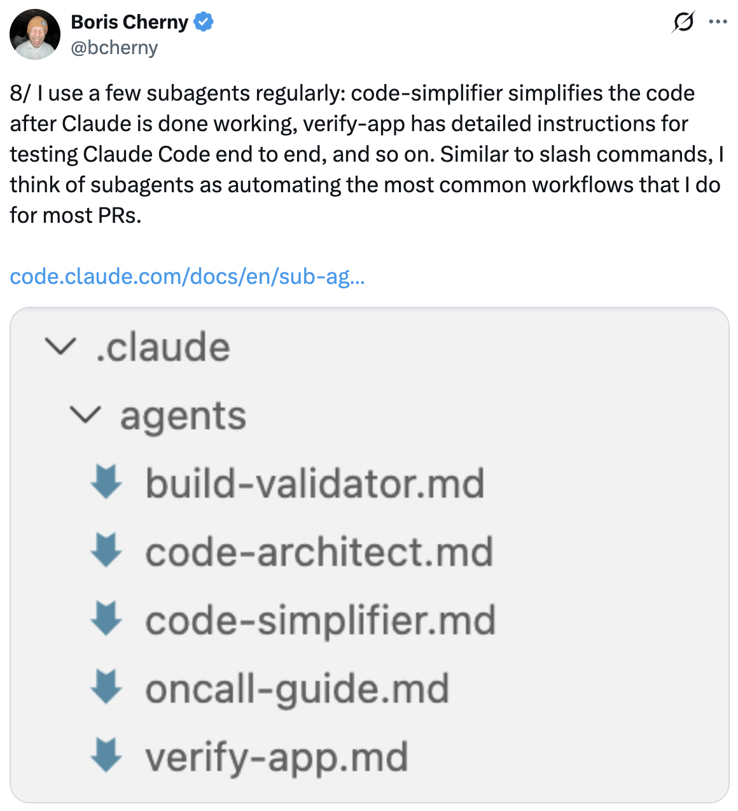

# How I Use Claude Code — 13 Tips from Boris Cherny

A summary of setup tips shared by Boris Cherny ([@bcherny](https://x.com/bcherny)), creator of Claude Code, on January 3, 2026.

<table width="100%">
<tr>
<td><a href="../">← Back to Claude Code Best Practice</a></td>
<td align="right"></td>
</tr>
</table>

---

## Context

Boris shared his personal Claude Code setup, noting it's "surprisingly vanilla" — Claude Code works great out of the box, so he doesn't customize it much. There's no one correct way to use it: the team intentionally builds it so you can use, customize, and hack it however you like. Each person on the Claude Code team uses it very differently.

<a href="https://x.com/bcherny/status/2007179832300581177"></a>

---

## 1/ Run 5 Claudes in Parallel

Run 5 Claudes in parallel in your terminal. Number your tabs 1–5, and use system notifications to know when a Claude needs input.

See: [Terminal Setup Docs](https://code.claude.com/docs/en/terminal)

<a href="https://x.com/bcherny/status/2007179833990885678"></a>

---

## 2/ Use claude.ai/code for Even More Parallelism

Run 5–10 Claudes on claude.ai/code in parallel with your local Claudes. Hand off local sessions to web sessions using `claude.ai/code`, manually kick off sessions in Chrome, and teleport back and forth.

<a href="https://x.com/bcherny/status/2007179836704600237"></a>

---

## 3/ Use Opus with Thinking for Everything

Use Opus 4.5 with thinking for everything. It's the best coding model Boris has ever used — even though it's bigger and slower than Sonnet, since you have to steer it less and it's better at tool use, it is almost always faster than using a smaller model in the end.

<a href="https://x.com/bcherny/status/2007179838864666847"></a>

---

## 4/ Share a Single CLAUDE.md with Your Team

Share a single `CLAUDE.md` for the repo. Check it into git, and have the whole team contribute multiple times a week. Anytime Claude does something incorrectly, add it to the `CLAUDE.md` so Claude knows not to do it next time.

<a href="https://x.com/bcherny/status/2007179840848597422"></a>

---

## 5/ Tag @claude on PRs to Update CLAUDE.md

During code review, tag `@claude` on your coworkers' PRs to add something to the `CLAUDE.md` as part of the PR. Use the Claude Code GitHub action ([install-@hub-action](https://github.com/apps/claude)) for this — it's Boris's version of Compounding Engineering.

<a href="https://x.com/bcherny/status/2007179842928947333"></a>

---

## 6/ Start Most Sessions in Plan Mode

Start most sessions in Plan mode (shift+tab twice). If the goal is to write a Pull Request, use Plan mode and go back and forth with Claude until you like its plan. From there, switch into auto-accept edits mode and Claude can usually 1-shot it. A good plan is really important.

<a href="https://x.com/bcherny/status/2007179845336527000"></a>

---

## 7/ Use Slash Commands for Inner Loop Workflows

Use slash commands for every "inner loop" workflow that you do many times a day. This saves you from repeated prompting, and makes it so Claude can use these workflows too. Commands are checked into git and live in `.claude/commands/`.

Example: `/commit-push-pr` — Commit, push, and open a PR.

<a href="https://x.com/bcherny/status/2007179847949500714"></a>

---

## 8/ Use Subagents to Automate Common Workflows

Use a few subagents regularly: `code-simplifier` simplifies the code after Claude is done working, `verify-app` has detailed instructions for testing Claude Code end to end, and so on. Think of subagents as automating the most common workflows — similar to slash commands.

Subagents live in `.claude/agents/`.

<a href="https://x.com/bcherny/status/2007179850139000872"></a>

---

## 9/ Use a PostToolUse Hook to Auto-Format Code

Use a `PostToolUse` hook to format Claude's code. Claude usually generates well-formatted code out of the box, and the hook handles the last 10% to avoid formatting errors in CI later.

```json
"PostToolUse": [
  {
    "matcher": "Write|Edit",
    "hooks": [
      {
        "type": "command",
        "command": "bun run format || true"
      }
    ]
  }
]
```

<a href="https://x.com/bcherny/status/2007179852047335529"></a>

---

## 10/ Pre-allow Permissions Instead of --dangerously-skip-permissions

Don't use `--dangerously-skip-permissions`. Instead, use `/permissions` to pre-allow common bash commands that you know are safe in your environment, to avoid unnecessary permission prompts. Most of these are checked into `.claude/settings.json` and shared with the team.

<a href="https://x.com/bcherny/status/2007179854077407667"></a>

---

## 11/ Let Claude Use All Your Tools via MCP

Claude Code uses all your tools. It often searches and posts to Slack (via the MCP server), runs BigQuery queries to answer analytics questions (using `bq` CLI), grabs error logs from Sentry, etc. The Slack MCP configuration is checked into `.mcp.json` and shared with the team.

<a href="https://x.com/bcherny/status/2007179856266789204"></a>

---

## 12/ Verify Long-Running Tasks with Background Agents

For very long-running tasks, either (a) prompt Claude to verify its work with a background agent when it's done, (b) use an agent Stop hook to do that more deterministically, or (c) use the ralph-wiggum plugin (originally dreamt up by @GeoffreyHuntley).

<a href="https://x.com/bcherny/status/2007179858435281082"></a>

---

## 13/ Give Claude a Way to Verify Its Work

Probably the most important thing to get great results out of Claude Code — give Claude a way to verify its work. If Claude has that feedback loop, it will 2–3x the quality of the final result.

Claude tests every single change Boris lands.

<a href="https://x.com/bcherny/status/2007179861115511237"></a>

---

## Sources

- [Boris Cherny (@bcherny) on X — January 3, 2026](https://x.com/bcherny/status/2007179832300581177)
