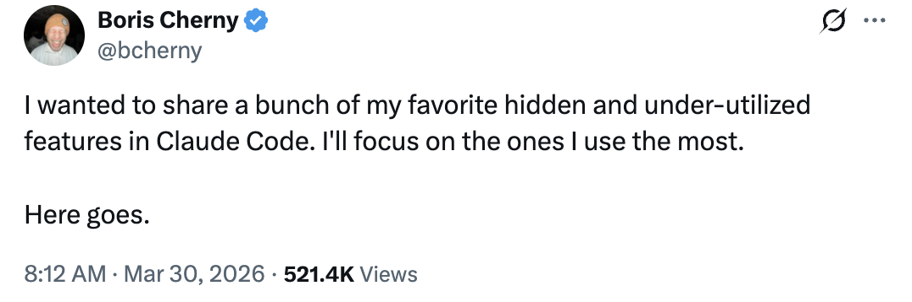
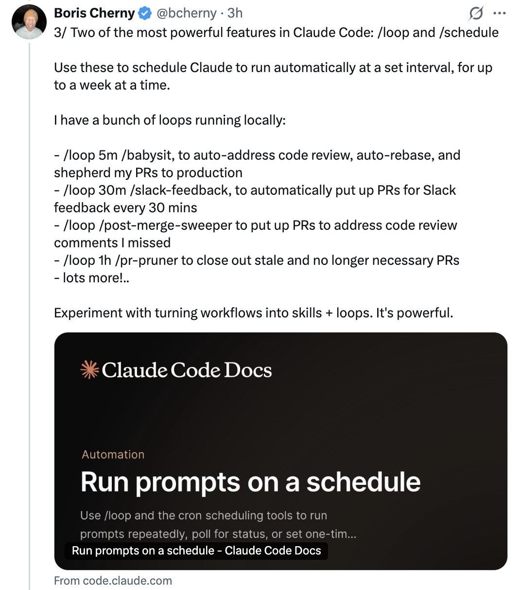
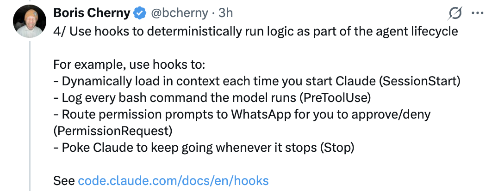
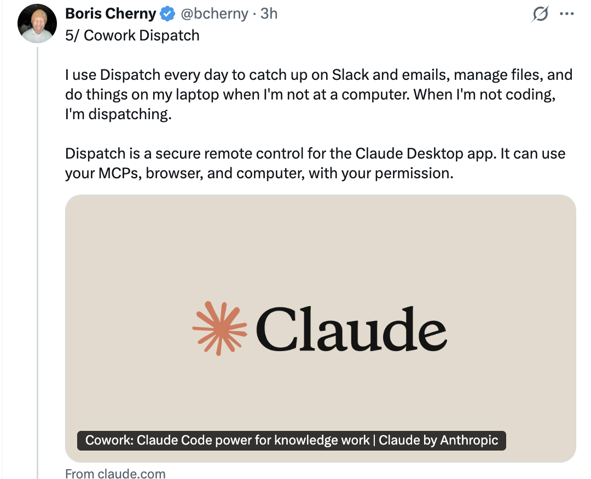
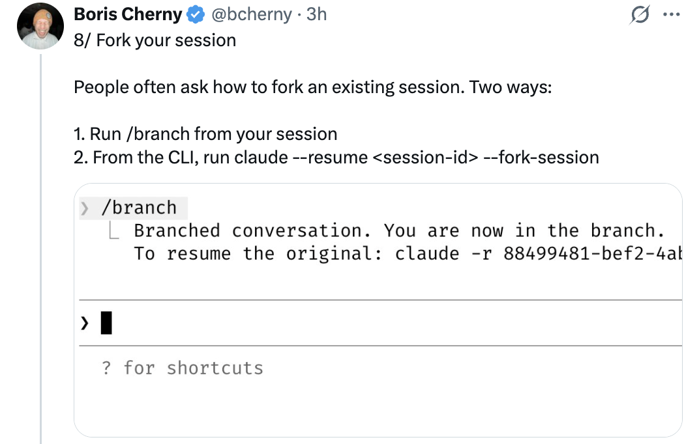
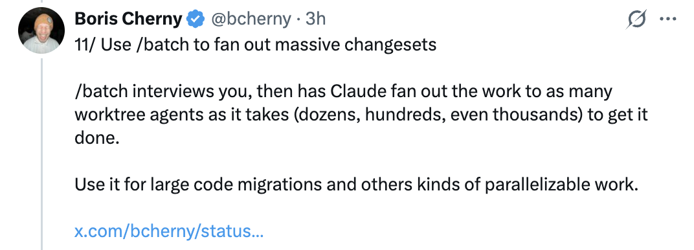

# 15 Hidden & Under-Utilized Features in Claude Code — From Boris Cherny

A summary of tips shared by Boris Cherny ([@bcherny](https://x.com/bcherny)), creator of Claude Code, on March 30, 2026.

<table width="100%">
<tr>
<td><a href="../">← Back to Claude Code Best Practice</a></td>
<td align="right"></td>
</tr>
</table>

---

## Context

Boris shared a bunch of his favorite hidden and under-utilized features in Claude Code, focusing on the ones he uses the most.

<a href="https://x.com/bcherny/status/2038454336355999749"></a>

---

## 1/ Claude Code Has a Mobile App

Did you know Claude Code has a mobile app? Boris writes a lot of his code from the iOS app — it's a convenient way to make changes without opening a laptop.

- Download the Claude app for iOS/Android
- Navigate to the **Code** tab on the left
- You can review changes, approve PRs, and write code directly from your phone

<a href="https://x.com/bcherny/status/2038454337811386436"></a>

---

## 2/ Move Sessions Between Mobile/Web/Desktop and Terminal

Run `claude --teleport` or `/teleport` to continue a cloud session on your machine. Or run `/remote-control` to control a locally running session from your phone/web.

- **Teleport**: pulls a cloud session down to your local terminal
- **Remote Control**: lets you control a local session from any device
- Boris has **"Enable Remote Control for all sessions"** set in his `/config`

<a href="https://x.com/bcherny/status/2038454339933548804"></a>

---

## 3/ /loop and /schedule — Two of the Most Powerful Features

Use these to schedule Claude to run automatically at a set interval, for up to a week at a time. Boris has a bunch of loops running locally:

- `/loop 5m /babysit` — auto-address code review, auto-rebase, and shepherd PRs to production
- `/loop 30m /slack-feedback` — automatically put up PRs for Slack feedback every 30 mins
- `/loop /post-merge-sweeper` — put up PRs to address code review comments he missed
- `/loop 1h /pr-pruner` — close out stale and no longer necessary PRs
- ...and lots more!

Experiment with turning workflows into skills + loops. It's powerful.

<a href="https://x.com/bcherny/status/2038454341884154269"></a>

---

## 4/ Use Hooks to Deterministically Run Logic

Use hooks to run logic as part of the agent lifecycle. For example:

- **Dynamically load** in context each time you start Claude (`SessionStart`)
- **Log every bash command** the model runs (`PreToolUse`)
- **Route permission prompts** to WhatsApp for you to approve/deny (`PermissionRequest`)
- **Poke Claude** to keep going whenever it stops (`Stop`)

<a href="https://x.com/bcherny/status/2038454343519932844"></a>

---

## 5/ Cowork Dispatch

Boris uses Dispatch every day to catch up on Slack and emails, manage files, and do things on his laptop when he's not at a computer. When he's not coding, he's dispatching.

- Dispatch is a **secure remote control** for the Claude Desktop app
- It can use your MCPs, browser, and computer, with your permission
- Think of it as a way to delegate non-coding tasks to Claude from anywhere

<a href="https://x.com/bcherny/status/2038454345419936040"></a>

---

## 6/ Use the Chrome Extension for Frontend Work

The most important tip for using Claude Code: **give Claude a way to verify its output.** Once you do that, Claude will iterate until the result is great.

- Think of it like asking someone to build a website but they aren't allowed to use a browser — the result probably won't look good
- Give Claude a browser and it will write code and iterate until it looks good
- Boris uses the Chrome extension every time he works on web code — it tends to work more reliably than other similar MCPs

<a href="https://x.com/bcherny/status/2038454347156398333"></a>

---

## 7/ Use the Claude Desktop App to Auto-Start and Test Web Servers

Along the same vein, the Desktop app bundles in the ability for Claude to **automatically run your web server and even test it in a built-in browser.**

- You can set up something similar in CLI or VSCode using the Chrome extension
- Or just use the Desktop app for the integrated experience

<a href="https://x.com/bcherny/status/2038454348804714642"></a>

---

## 8/ Fork Your Session

People often ask how to fork an existing session. Two ways:

1. Run `/branch` from your session
2. From the CLI, run `claude --resume <session-id> --fork-session`

`/branch` creates a branched conversation — you are now in the branch. To resume the original, use `claude -r <original-session-id>`.

<a href="https://x.com/bcherny/status/2038454350214041740"></a>

---

## 9/ Use /btw for Side Queries

Boris uses this all the time to answer quick questions while the agent works. `/btw` lets you ask a side question without interrupting the agent's current task.

Example:
```
/btw how do I spell dachshund?
> dachshund — German for "badger dog" (dachs + badger, hund + dog).
↑/↓ to scroll · Space, Enter, or Escape to dismiss
```

<a href="https://x.com/bcherny/status/2038454351849787485"></a>

---

## 10/ Use Git Worktrees

Claude Code ships with deep support for git worktrees. Worktrees are essential for doing lots of parallel work in the same repository. Boris has **dozens of Claudes running at all times**, and this is how he does it.

- Use `claude -w` to start a new session in a worktree
- Or hit the **"worktree" checkbox** in the Claude Desktop app
- For non-git VCS users, use the `WorktreeCreate` hook to add your own logic for worktree creation

<a href="https://x.com/bcherny/status/2038454353787519164"></a>

---

## 11/ Use /batch to Fan Out Massive Changesets

`/batch` interviews you, then has Claude fan out the work to as many **worktree agents** as it takes (dozens, hundreds, even thousands) to get it done.

- Use it for large code migrations and other kinds of parallelizable work
- Each worktree agent works independently on its own copy of the codebase

<a href="https://x.com/bcherny/status/2038454355469484142"></a>

---

## 12/ Use --bare to Speed Up SDK Startup by Up to 10x

By default, when you run `claude -p` (or the TypeScript or Python SDKs), Claude searches for local CLAUDE.md's, settings, and MCPs. But for non-interactive usage, most of the time you want to explicitly specify what to load via `--system-prompt`, `--mcp-config`, `--settings`, etc.

- This was a design oversight when the SDK was first built
- In a future version, they will flip the default to `--bare`
- For now, opt in with the flag to get up to **10x faster startup**

```bash
claude -p "summarize this codebase" \
    --output-format=stream-json \
    --verbose \
    --bare
```

<a href="https://x.com/bcherny/status/2038454357088457168"></a>

---

## 13/ Use --add-dir to Give Claude Access to More Folders

When working across multiple repositories, Boris usually starts Claude in one repo and uses `--add-dir` (or `/add-dir`) to let Claude see the other repo.

- This not only tells Claude about the repo, but also **gives it permissions** to work in the repo
- Or, add `"additionalDirectories"` to your team's `settings.json` to always load in additional folders when starting Claude Code

<a href="https://x.com/bcherny/status/2038454359047156203"></a>

---

## 14/ Use --agent to Give Claude Code a Custom System Prompt & Tools

Custom agents are a powerful primitive that often gets overlooked. To use it, just define a new agent in `.claude/agents/`, then run:

```bash
claude --agent=<your agent's name>
```

- Agents can have restricted tools, custom descriptions, and specific models
- They're great for creating read-only agents, specialized review agents, or domain-specific tools

<a href="https://x.com/bcherny/status/2038454360418787764"></a>

---

## 15/ Use /voice to Enable Voice Input

Fun fact: Boris does most of his coding by speaking to Claude, rather than typing.

- Run `/voice` in CLI then hold the space bar to speak
- Press the voice button on Desktop
- Or enable dictation in your iOS settings

<a href="https://x.com/bcherny/status/2038454362226467112"></a>

---

## Sources

- [Boris Cherny (@bcherny) on X — March 30, 2026](https://x.com/bcherny/status/2038454336355999749)
