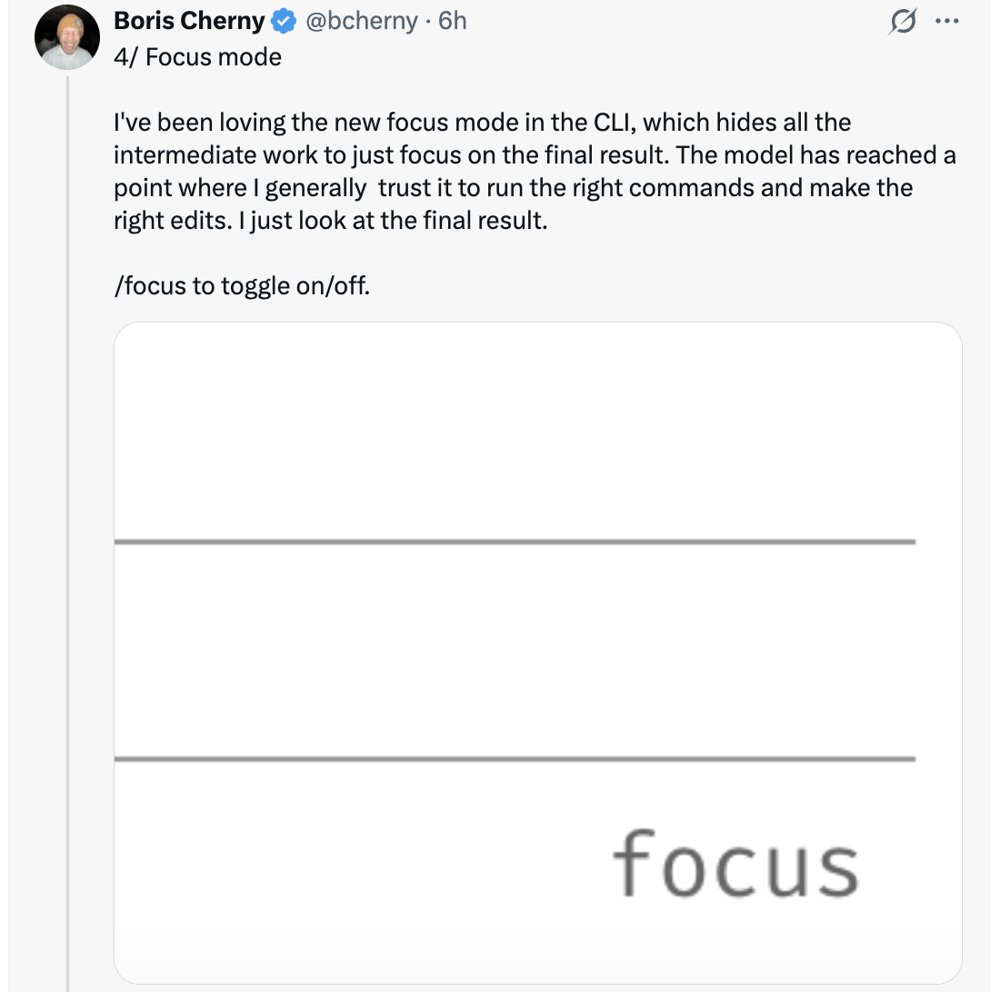

# 6 Tips for Getting More Out of Opus 4.7 — From Boris Cherny

A thread of tips shared by Boris Cherny ([@bcherny](https://x.com/bcherny)), creator of Claude Code, on April 16, 2026 — after dogfooding Opus 4.7 for the last few weeks.

<table width="100%">
<tr>
<td><a href="../">← Back to Claude Code Best Practice</a></td>
<td align="right"></td>
</tr>
</table>

---

## Context

After dogfooding Opus 4.7 for a few weeks, Boris has been feeling "incredibly productive" and shared six ways to get more out of the new model — from permission automation to effort tuning to verification patterns.

<a href="https://x.com/bcherny"></a>

---

## 1/ Auto Mode — No More Permission Prompts

Opus 4.7 loves doing complex, long-running tasks: deep research, refactoring code, building complex features, iterating until a performance benchmark is hit. In the past, you either had to babyset the model while it did these sorts of long tasks, or use `--dangerously-skip-permissions`.

Anthropic recently rolled out **auto mode** as a safer alternative. In this mode, permission prompts are routed to a model-based classifier that decides whether the command is safe to run:

- If it's safe, auto-approve
- If it's risky, pause and ask

This means no more babysitting while the model runs. More than that, it means you can run more Claudes in parallel — if safe, you can switch focus to the next Claude.

Auto mode is now available for Opus 4.7 for Max, Teams, and Enterprise users. **Shift+Tab** to cycle between `Ask permissions` → `Plan mode` → `Auto mode` in the CLI, or choose it from the dropdown in Desktop or VS Code.

<a href="https://x.com/bcherny"></a>

---

## 2/ The New /fewer-permission-prompts Skill

Anthropic released a new `/fewer-permission-prompts` skill. It scans through your session history to find common bash and MCP commands that are safe but repeatedly prompt for permission. It then recommends a list of commands to add to your permissions allowlist.

Use this to tune up your permissions and avoid unnecessary permission prompts, especially if you don't use auto mode.

<a href="https://x.com/bcherny"></a>

---

## 3/ Recaps

Anthropic shipped **recaps** earlier this week, to prep for Opus 4.7. Recaps are short summaries of what an agent did and what's next.

Very useful when returning to a long-running session after a few minutes or a few hours:

```
* Cogitated for 6m 27s

* recap: Fixing the post-submit transcript shift bug. The styling-flash
  part is shipped as PR #29869 (auto-merge on, posted to stamps). Next:
  I need a screen recording of the remaining horizontal rewrap on `cc -c`
  to target that separate cause. (disable recaps in /config)
```

Disable recaps in `/config` if you don't want them.

<a href="https://x.com/bcherny"></a>

---

## 4/ Focus Mode

Boris has been loving the new **focus mode** in the CLI, which hides all the intermediate work to just focus on the final result. The model has reached a point where he generally trusts it to run the right commands and make the right edits. He just looks at the final result.

Use `/focus` to toggle on/off.

<a href="https://x.com/bcherny"></a>

---

## 5/ Configure Your Effort Level

Opus 4.7 uses **adaptive thinking** instead of thinking budgets. To tune the model to think more or less, tune effort.

- **Lower effort** — faster responses and lower token usage
- **Higher effort** — the most intelligence and capability

The slider presents five levels: `low` · `medium` · `high` · `xhigh` · `max` — Speed on the left, Intelligence on the right.

<a href="https://x.com/bcherny"></a>

---

## 6/ Give Claude a Way to Verify Its Work

Finally, make sure Claude has a way to verify its work. This has always been important — now 4.7 is 2-3x what you get out of Claude, so it's more important than ever.

Verification looks different depending on the task:

- **Backend work** — have Claude run your server/service to test end-to-end
- **Frontend work** — use the [Claude Chromium extension](https://code.claude.com/docs/en/chrome) to give Claude a way to control your browser
- **Desktop apps** — use Computer Use

Boris's prompts these days look like `Claude do blah blah /go`, where `/go` is a skill that:

1. Tests itself end-to-end using bash, browser, or computer use
2. Runs `/simplify`
3. Puts up a PR

For long-running work, verification matters even more — when you come back to a task, you know the code works.

<a href="https://x.com/bcherny"></a>

---

## Sources

- [Boris Cherny (@bcherny) on X — April 16, 2026](https://x.com/bcherny)
