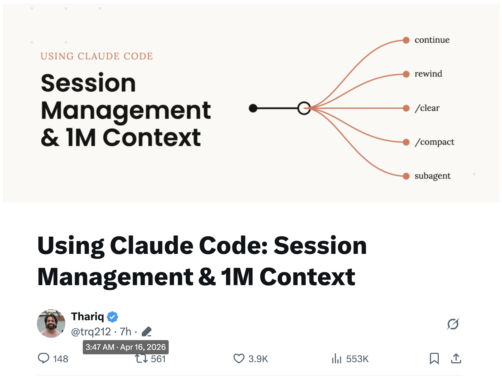
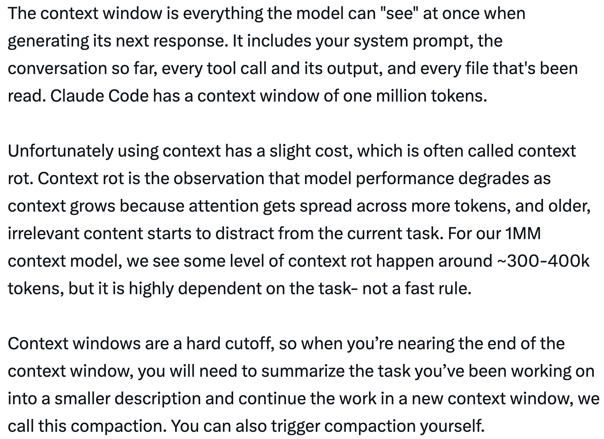
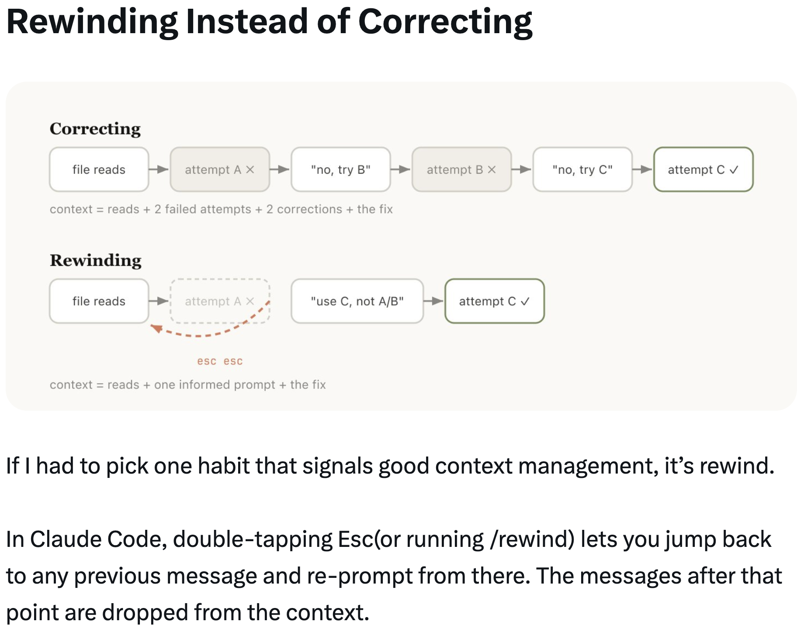

# Using Claude Code: Session Management & 1M Context — Thariq

A guide on managing sessions, context windows, and compaction in Claude Code, shared by Thariq ([@trq212](https://x.com/trq212)) on April 16, 2026.

<table width="100%">
<tr>
<td><a href="../">← Back to Claude Code Best Practice</a></td>
<td align="right"></td>
</tr>
</table>

---

## Context

With the 1M token context window, Claude Code can handle longer tasks more reliably — but it also opens the door to context pollution if you're not deliberate about managing your sessions. Session management matters more than ever: when to start fresh, when to compact, when to rewind, and when to delegate to subagents.

---

## A Quick Primer on Context, Compaction & Context Rot

The context window is everything the model can "see" at once when generating its next response. It includes your system prompt, the conversation so far, every tool call and its output, and every file that's been read. Claude Code has a context window of **one million tokens**.

Unfortunately using context has a slight cost — **context rot**. Model performance degrades as context grows because attention gets spread across more tokens, and older, irrelevant content starts to distract from the current task. For the 1M context model, some level of context rot happens around **~300-400k tokens**, but it is highly dependent on the task — not a fast rule.

Context windows are a hard cutoff. When you're nearing the end, you need to summarize the task and continue in a new context window — this is **compaction**. You can also trigger compaction yourself.

---

## Every Turn Is a Branching Point

After Claude finishes a turn, you have a surprising number of options for what to do next:

- **Continue** — send another message in the same session
- **/rewind (esc esc)** — jump back to a previous message and try again from there
- **/clear** — start a new session, usually with a brief you've distilled from what you just learned
- **Compact** — summarize the session so far and keep going on top of the summary
- **Subagents** — delegate the next chunk of work to an agent with its own clean context, and only pull its result back in

While the most natural is just to continue, the other four options exist to help you manage your context.

Each option carries a different amount of existing context forward:

| Fresh session | Compact | Subagent | Rewind | Continue |
|:---:|:---:|:---:|:---:|:---:|
| your brief only | lossy summary | all + result | prefix kept, tail cut | everything stays |
| *none of it* | | | | *all of it* |

---

## When to Start a New Session

The new 1M context windows means you can now do longer tasks more reliably — for example, building a full-stack app from scratch. But just because your model hasn't run out of context, it doesn't mean you shouldn't start a new session.

**General rule of thumb: when you start a new task, you should also start a new session.**

A grey area is when you may want to do related tasks where some of the context is still necessary, but not all. For example, writing the documentation for a feature you just implemented. While you could start a new session, Claude would have to reread the files, which would be slower and more expensive. Since documentation may not be a highly intelligence-sensitive task, the extra context is probably worth the efficiency gain.

---

## Rewinding Instead of Correcting

If Thariq had to pick one habit that signals good context management, it's **rewind**.

In Claude Code, double-tapping Esc (or running `/rewind`) lets you jump back to any previous message and re-prompt from there. The messages after that point are dropped from the context.

**Correcting** (saying "no, try B" after a failed attempt A) leaves the failed attempt in context:
> context = reads + 2 failed attempts + 2 corrections + the fix

**Rewinding** (going back to before the failed attempt and re-prompting with what you learned) is cleaner:
> context = reads + one informed prompt + the fix

Rewind is often the better approach. For example, Claude reads five files, tries an approach, and it doesn't work. Your instinct may be to type "that didn't work, try X instead." But the better move is to rewind to just after the file reads, and re-prompt with what you learned: "Don't use approach A, the foo module doesn't expose that — go straight to B."

You can also use **"summarize from here"** to have Claude summarize its learnings and create a handoff message, kind of like a message to the previous iteration of Claude from its future self that tried something and it didn't work.

---

## Compacting vs. Fresh Sessions

Once a session gets long, you have two ways to shed weight: `/compact` or `/clear` (and start fresh). They feel similar but behave very differently.

**Compact** asks the model to summarize the conversation so far, then replaces the history with that summary. It's lossy — you're trusting Claude to decide what mattered, but you didn't have to write anything yourself. Claude might be more thorough in including important learnings or files. You can also steer it by passing instructions (`/compact focus on the auth refactor, drop the test debugging`).

- **Mid-task**, keep momentum — details can be fuzzy
- Cheap, keep going

**Fresh + brief** (`/clear`) means *you* write down what matters ("we're refactoring the auth middleware, the constraint is X, the files that matter are A and B, we've ruled out approach Y") and start clean. It's more work, but the resulting context is what *you* decided was relevant.

- **High-stakes** next step — found one fact in 100K of exploration
- More work, more exact

---

## What Causes a Bad Compact?

If you run a lot of long running sessions, you might have noticed times in which compacting might be particularly bad. Bad compacts can happen when the model can't predict the direction your work is going.

For example, autocompact fires after a long debugging session and summarizes the investigation. Your next message is "now fix that other warning we saw in bar.ts." But because the session was focused on debugging, the other warning might have been dropped from the summary.

This is particularly difficult, because due to context rot, the model is at its least intelligent point when compacting. With one million context, you have more time to `/compact` proactively with a description of what you want to do.

---

## Subagents & Fresh Context Windows

Subagents are a form of context management, useful for when you know in advance that a chunk of work will produce a lot of intermediate output you won't need again.

When Claude spawns a subagent via the Agent tool, that subagent gets its own fresh context window. It can do as much work as it needs to, and then synthesize its results so only the final report comes back to the parent.

The mental test: **will I need this tool output again, or just the conclusion?**

The exploration noise is garbage-collected when the subagent exits — 20 file reads, 12 greps, 3 dead ends — only the final report returns to the parent context.

While Claude Code will automatically call subagents, you may want to tell it to explicitly do this. For example:

- "Spin up a subagent to verify the result of this work based on the following spec file"
- "Spin off a subagent to read through this other codebase and summarize how it implemented the auth flow, then implement it yourself in the same way"
- "Spin off a subagent to write the docs on this feature based on my git changes"

---

## Summary

When Claude has ended a turn and you're about to send a new message, you have a decision point. Over time, Claude will handle this itself, but for now this is one of the ways you can guide Claude's output.

| Situation | Reach for | Why |
|-----------|-----------|-----|
| Same task, context is still relevant | **Continue** | Everything in the window is still load-bearing — don't pay to rebuild it |
| Claude went down a wrong path | **Rewind** (double-Esc) | Keep the useful file reads, drop the failed attempt, re-prompt with what you learned |
| Mid-task but session is bloated with stale debugging/exploration | **/compact \<hint\>** | Low effort; Claude decides what mattered. Steer it with a hint if needed |
| Starting a genuinely new task | **/clear** | Zero rot; you control exactly what carries forward |
| Next step will generate lots of output you'll only need the conclusion from | **Subagent** | Intermediate tool noise stays in the child's context; only the result comes back |

---

## Sources

- [Thariq (@trq212) on X — April 16, 2026](https://x.com/trq212)
