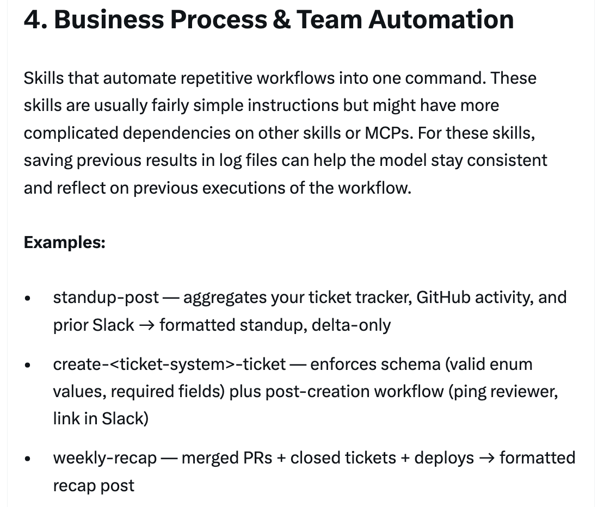
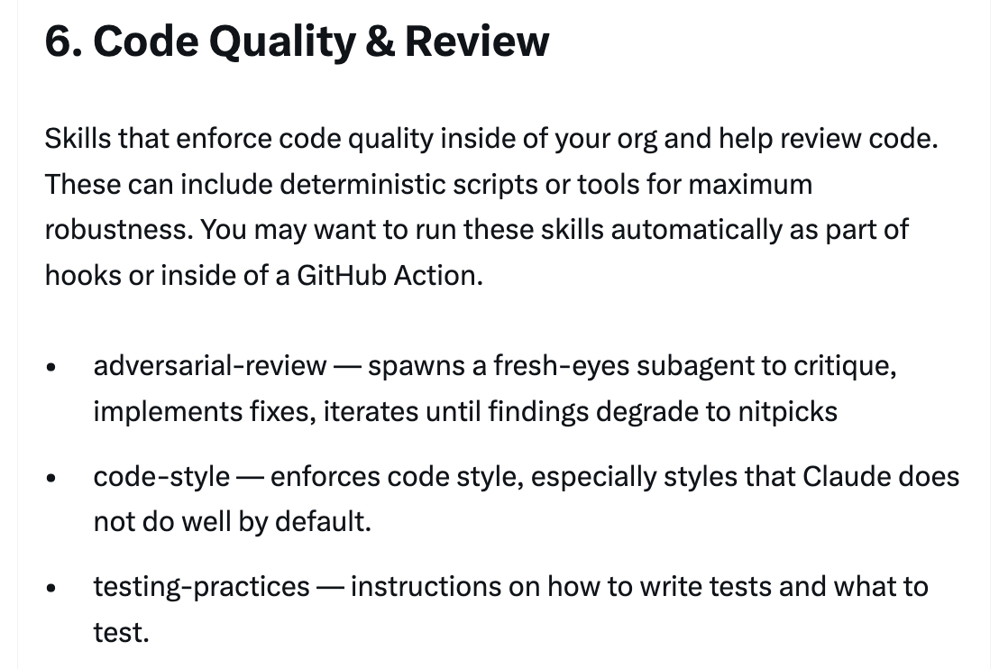
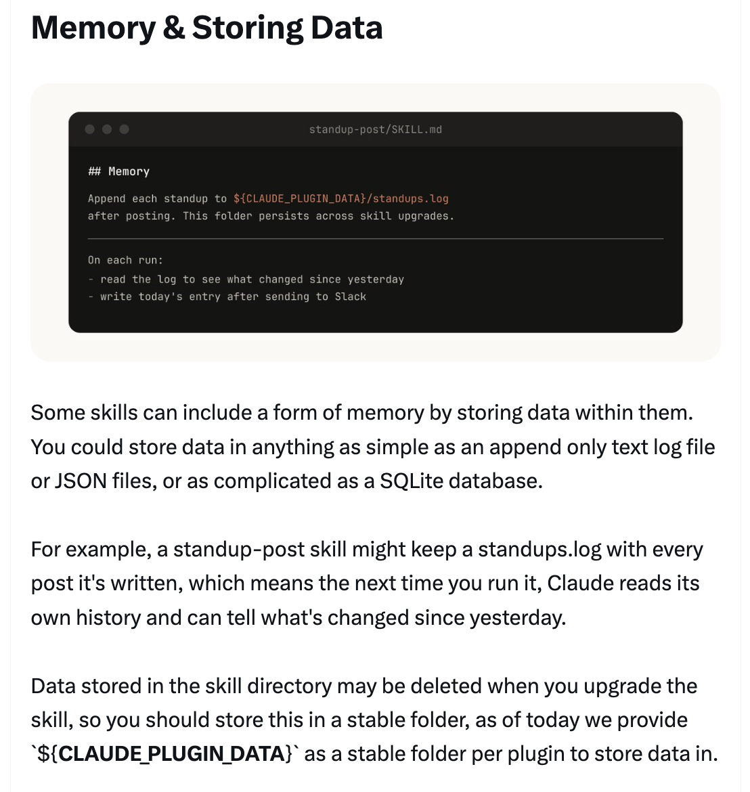
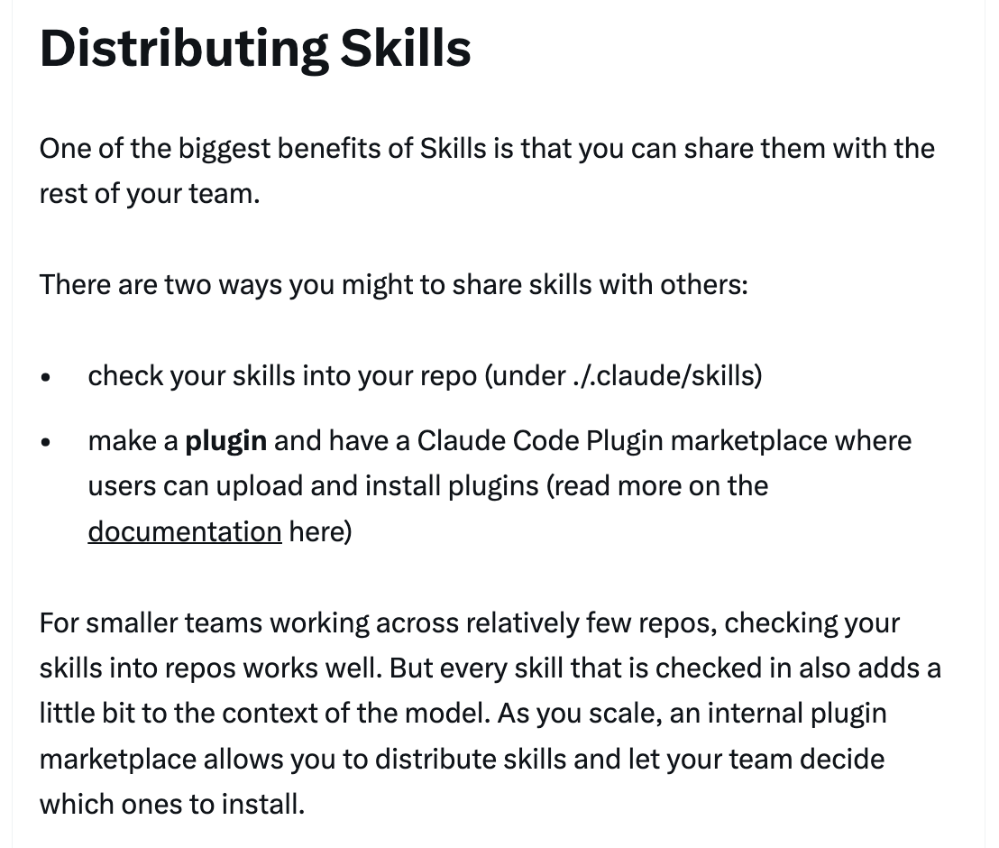
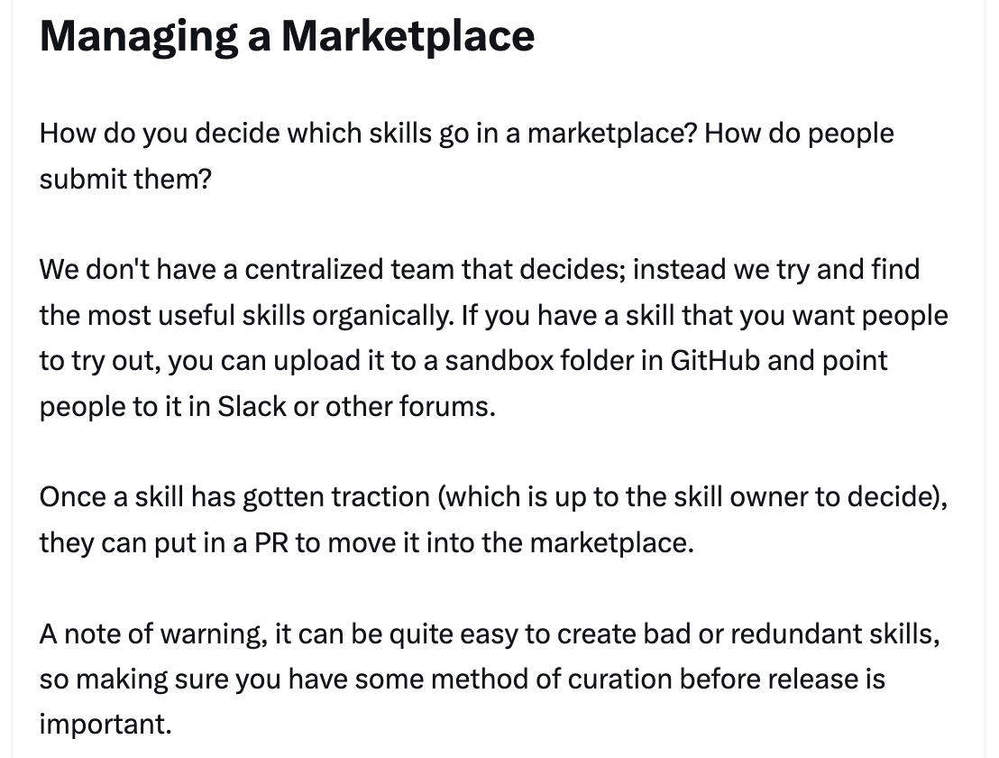
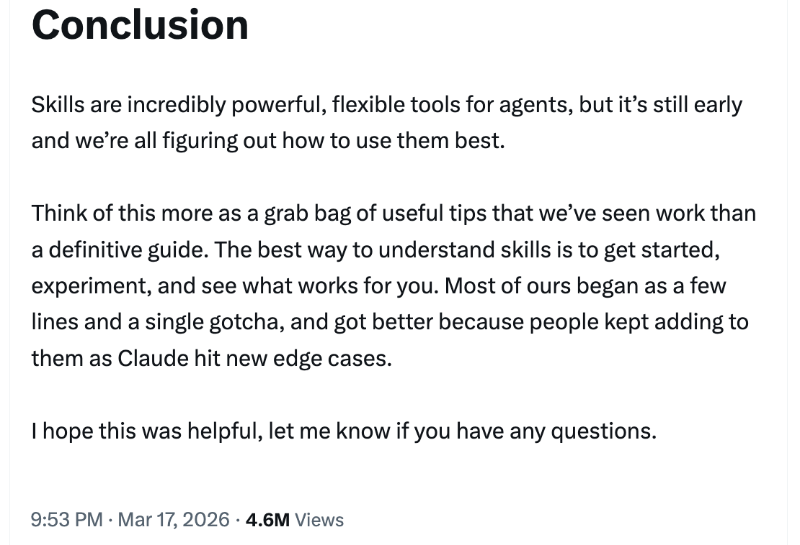

# Lessons from Building Claude Code: How We Use Skills — Thariq

A comprehensive guide on how Anthropic uses skills internally, shared by Thariq ([@trq212](https://x.com/trq212)) on March 17, 2026.

<table width="100%">
<tr>
<td><a href="../">← Back to Claude Code Best Practice</a></td>
<td align="right"></td>
</tr>
</table>

---

## Context

Skills have become one of the most used extension points in Claude Code. They're flexible, easy to make, and simple to distribute. But this flexibility also makes it hard to know what works best. Thariq shares the lessons learned from using skills extensively at Anthropic with hundreds of them in active use.

---

## What are Skills?

A common misconception is that skills are "just markdown files", but the most interesting part is that they're **folders** that can include scripts, assets, data, etc. — things the agent can discover, explore, and manipulate. Skills also have a wide variety of configuration options including registering dynamic hooks.

---

## Types of Skills

After cataloging all of their skills, the team noticed they cluster into 9 recurring categories. The best skills fit cleanly into one; the more confusing ones straddle several.

---

### 1/ Library & API Reference

Skills that explain how to correctly use a library, CLI, or SDKs. These could be for internal libraries or common libraries that Claude Code sometimes has trouble with. They often include a folder of reference code snippets and a list of gotchas to avoid when writing a script.

**Examples:** billing-lib, internal-platform-cli, frontend-design

---

### 2/ Product Verification

Skills that describe how to test or verify that your code is working. These are often paired with an external tool like Playwright, tmux, etc. Verification skills are extremely useful for ensuring Claude's output is correct. It can be worth having an engineer spend a week just making your verification skills excellent.

**Examples:** signup-flow-driver, checkout-verifier, tmux-cli-driver

---

### 3/ Data Fetching & Analysis

Skills that connect to your data and monitoring stacks. These might include libraries to fetch your data with credentials, specific dashboard IDs, etc., as well as instructions on common workflows or ways to get data.

**Examples:** funnel-query, cohort-compare, grafana

---

### 4/ Business Process & Team Automation

Skills that automate repetitive workflows into one command. These are usually fairly simple instructions but might have more complicated dependencies on other skills or MCPs. Saving previous results in log files can help the model stay consistent and reflect on previous executions of the workflow.

**Examples:** standup-post, create-\<ticket-system\>-ticket, weekly-recap

---

### 5/ Code Scaffolding & Templates

Skills that generate framework boilerplate for a specific function in the codebase. You might combine these skills with scripts that can be composed. They are especially useful when your scaffolding has natural language requirements that can't be purely covered by code.

**Examples:** new-\<framework\>-workflow, new-migration, create-app

---

### 6/ Code Quality & Review

Skills that enforce code quality inside of your org and help review code. These can include deterministic scripts or tools for maximum robustness. You may want to run these skills automatically as part of hooks or inside of a GitHub Action.

**Examples:** adversarial-review, code-style, testing-practices

---

### 7/ CI/CD & Deployment

Skills that help you fetch, push, and deploy code inside of your codebase. These skills may reference other skills to collect data.

**Examples:** babysit-pr, deploy-\<service\>, cherry-pick-prod

---

### 8/ Runbooks

Skills that take a symptom (such as a Slack thread, alert, or error signature), walk through a multi-tool investigation, and produce a structured report.

**Examples:** \<service\>-debugging, oncall-runner, log-correlator

---

### 9/ Infrastructure Operations

Skills that perform routine maintenance and operational procedures — some of which involve destructive actions that benefit from guardrails. These make it easier for engineers to follow best practices in critical operations.

**Examples:** \<resource\>-orphans, dependency-management, cost-investigation

---

## Tips for Making Skills

9 best practices for writing effective skills, plus guidance on distribution and measurement.

---

### Tip 1: Don't State the Obvious

Claude Code knows a lot about your codebase, and Claude knows a lot about coding, including many default opinions. If you're publishing a skill that is primarily about knowledge, try to focus on information that pushes Claude out of its normal way of thinking. The frontend design skill is a great example — it was built by iterating with customers on improving Claude's design taste, avoiding classic patterns like the Inter font and purple gradients.

---

### Tip 2: Build a Gotchas Section

The highest-signal content in any skill is the Gotchas section. These sections should be built up from common failure points that Claude runs into when using your skill. Ideally, you will update your skill over time to capture these gotchas.

---

### Tip 3: Use the File System & Progressive Disclosure

A skill is a folder, not just a markdown file. You should think of the entire file system as a form of context engineering and progressive disclosure. Tell Claude what files are in your skill, and it will read them at appropriate times. The simplest form is to point to other markdown files — e.g., split detailed function signatures and usage examples into `references/api.md`. You can have folders of references, scripts, examples, etc.

---

### Tip 4: Avoid Railroading Claude

Claude will generally try to stick to your instructions, and because skills are so reusable you'll want to be careful of being too specific. Give Claude the information it needs, but give it the flexibility to adapt to the situation. Instead of prescriptive step-by-step instructions, give the goal and constraints.

---

### Tip 5: Think through the Setup

Some skills may need to be set up with context from the user. A good pattern is to store this setup information in a `config.json` file in the skill directory. If the config is not set up, the agent can then ask the user for information. You can instruct Claude to use the AskUserQuestion tool for structured, multiple choice questions.

---

### Tip 6: The Description Field Is For the Model

When Claude Code starts a session, it builds a listing of every available skill with its description. This listing is what Claude scans to decide "is there a skill for this request?" Which means the description field is not a summary — it's a description of **when to trigger** this skill. Write it for the model.

---

### Tip 7: Memory & Storing Data

Some skills can include a form of memory by storing data within them. You could store data in anything as simple as an append-only text log file or JSON files, or as complicated as a SQLite database. Data stored in the skill directory may be deleted when you upgrade the skill, so use `${CLAUDE_PLUGIN_DATA}` as a stable folder per plugin to store data in.

---

### Tip 8: Store Scripts & Generate Code

One of the most powerful tools you can give Claude is code. Giving Claude scripts and libraries lets Claude spend its turns on composition, deciding what to do next rather than reconstructing boilerplate. Claude can then generate scripts on the fly to compose this functionality for more advanced analysis.

---

### Tip 9: On Demand Hooks

Skills can include hooks that are only activated when the skill is called, and last for the duration of the session. Use this for more opinionated hooks that you don't want to run all the time but are extremely useful sometimes.

**Examples:**
- `/careful` — blocks rm -rf, DROP TABLE, force-push, kubectl delete via PreToolUse matcher on Bash
- `/freeze` — blocks any Edit/Write that's not in a specific directory

---

## Distributing Skills

Two ways to share skills with your team:
- **Check into your repo** (under `.claude/skills`) — best for smaller teams working across relatively few repos
- **Make a plugin** and have a Claude Code Plugin marketplace where users can upload and install plugins

Every skill that is checked in also adds a little bit to the context of the model. As you scale, an internal plugin marketplace allows you to distribute skills and let your team decide which ones to install.

---

## Managing a Marketplace

There isn't a centralized team that decides which skills go into a marketplace. Instead, try and find the most useful skills organically. Upload to a sandbox folder in GitHub and point people to it in Slack or other forums. Once a skill has gotten traction (which is up to the skill owner to decide), they can put in a PR to move it into the marketplace. Curation before release is important to avoid redundant skills.

---

## Composing Skills

You may want to have skills that depend on each other. For example, a file upload skill that uploads a file, and a CSV generation skill that makes a CSV and uploads it. This sort of dependency management is not natively built into marketplaces or skills yet, but you can just reference other skills by name, and the model will invoke them if they are installed.

---

## Measuring Skills

To understand how a skill is doing, use a PreToolUse hook that lets you log skill usage within the company. This means you can find skills that are popular or are undertriggering compared to expectations.

---

## Conclusion

Skills are incredibly powerful, flexible tools for agents, but it's still early and we're all figuring out how to use them best. Think of this more as a grab bag of useful tips that we've seen work than a definitive guide. The best way to understand skills is to get started, experiment, and see what works for you. Most of ours began as a few lines and a single gotcha, and got better because people kept adding to them as Claude hit new edge cases.

---

## Sources

- [Thariq (@trq212) on X — March 17, 2026](https://x.com/trq212/status/2033949937936085378)
- [Skilljar — Agent Skills course](https://code.claude.com/docs/en/skills)
- [Skill Creator](https://code.claude.com/docs/en/skills)
