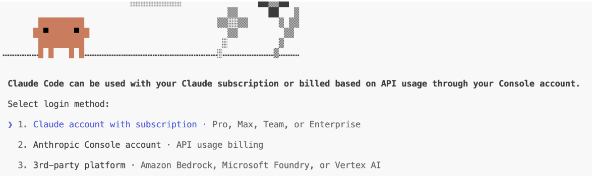

# Day 0 — Claude Code Setup

This guide walks you through installing Claude Code on your machine and authenticating so you can start using it.

## Step 1: Install Claude Code

Choose your operating system:

| OS | Guide |
|----|-------|
| Windows | [windows.md](windows.md) |
| Linux | [linux.md](linux.md) |
| macOS | [mac.md](mac.md) |

Follow the guide for your OS, then come back here for authentication.

---

## Step 2: Verify Installation

After following your OS-specific guide, confirm everything is working:

```bash
node --version    # Should show v18.x or higher
claude --version  # Should show the installed Claude Code version
```

---

## Step 3: Login



Run `claude` in your terminal. On first launch, it will ask you to choose a login method.

### Method 1: Subscription (Claude Pro / Max)

- Select **Claude.ai account**
- Browser opens — sign in and authorize
- Return to terminal, you're logged in

### Method 2a: API Key (Team Invite)

Your team admin invites you from the Anthropic dashboard.

- You receive an **invite email** — accept it and create your Anthropic account
- Run `claude` in your terminal
- Select **Anthropic API Key**
- Your key is **auto-generated** on the dashboard — no manual setup needed
- Claude Code starts working immediately

### Method 2b: API Key (You have the key)

If someone shared the key with you (via Slack, email, etc.) or you created your own:

- Run `claude` in your terminal
- Select **Anthropic API Key**
- Paste your key (starts with `sk-ant-`)
- The key is **stored permanently** — you won't be asked again

---